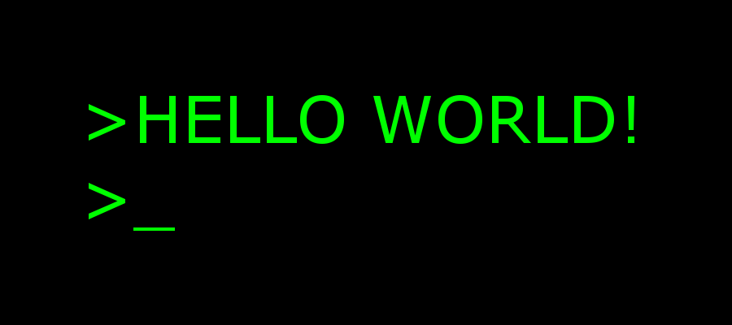
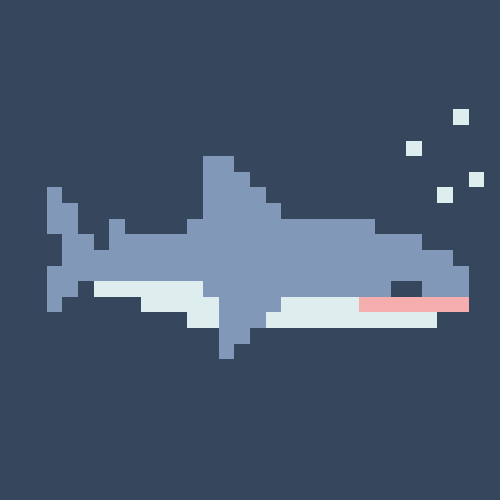

<!-- 

  <h2>SEVERUS VAPE</h2>
  

 -->

  
  
  

---

<h1>
   ABOUT ME:
</h1>
<h3>
  Self-taught programmer.
</h3>

---

<h1>
   LANGUAGE AND TOOLS:
</h1>

  &nbsp;
  &nbsp;
  &nbsp; 
  &nbsp;
  &nbsp;
  &nbsp;
  &nbsp;
  &nbsp;
  &nbsp;
  &nbsp;
  

---

<h1>
   MY STATS:
</h1>

<!-- 
&nbsp; -->
 

  
   

<!--  -->

<!--    
 -->
 

  

&nbsp;

  

